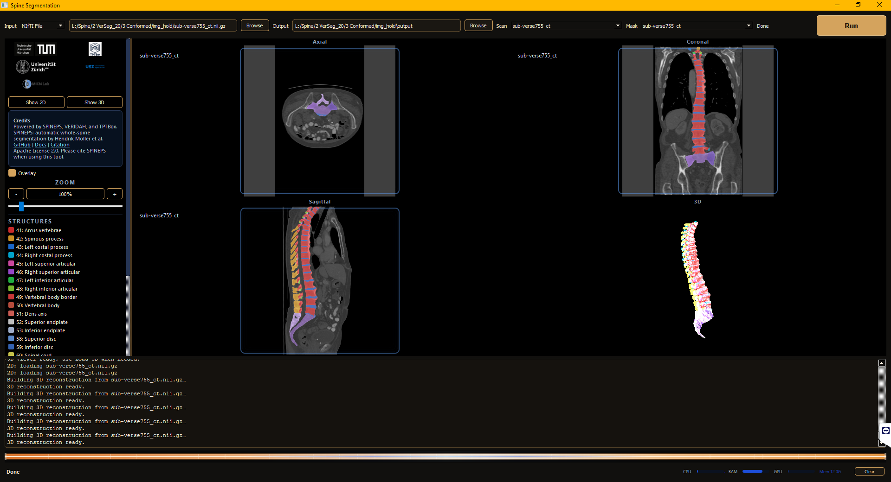

# SpinePS GUI

Desktop GUI for whole-spine segmentation with [SPINEPS](https://spineps.readthedocs.io/).

This project packages the SpinePS workflow into a hospital-friendly desktop application: select DICOM or NIfTI input, run segmentation locally, watch progress and system resources, then inspect the scan with an overlay and optional 3D surface view.



## What It Does

SPINEPS performs whole-spine segmentation through a two-phase pipeline:

- semantic segmentation of spinal structures and vertebra subregions
- instance segmentation of individual vertebrae
- optional VERIDAH vertebra labeling
- centroid and snapshot generation

The GUI wraps that workflow for Windows workstations and research machines. It handles input preparation, DICOM conversion, model loading, cached result detection, segmentation, overlay viewing, and export-oriented output folders.

## Features

- DICOM folder input with automatic DICOM-to-NIfTI conversion
- NIfTI input support (`.nii`, `.nii.gz`)
- robust DICOM series discovery that skips localizers, topograms, protocol images, and non-volume series
- local SpinePS inference using CT models by default
- optional CPU mode through environment variable
- progress log with stage-aware status updates
- CPU, RAM, GPU, and process memory monitor strip
- axial, coronal, and sagittal viewer with segmentation overlay
- 3D surface visualization and STL-oriented workflow support
- cached output reuse for repeated review

## Download

## Download the packaged Windows `.zip` from ownCloud:

## <https://owncloud.damutten.ch/s/hWm6MsNE1yTVPkv>

Keep the extracted folder together. The executable depends on bundled files in `_internal`.


## Basic Workflow

1. Choose `DICOM Folder` or `NIfTI File`.
2. Select the source scan.
3. Choose an output directory.
4. Start the pipeline.
5. Review the segmentation overlay when processing finishes.

The pipeline writes intermediate and final files into the selected output directory. Reusing the same output directory lets the GUI reuse cached conversions or segmentations when possible.

## Outputs

Typical output folders include:

```text
output/
  nifti_tmp/          converted or copied scan volumes
  segmentation/       GUI-ready segmentation overlays
  derivatives_seg/    native SpinePS derivatives
```

SPINEPS derivatives may include:

- `seg-spine` semantic/subregion mask
- `seg-vert` vertebra instance mask
- centroid JSON
- snapshot PNG
- raw/model-space outputs depending on SpinePS configuration


## Notes And Limitations

- This is a research/engineering GUI and is not a standalone clinical decision system.
- Input quality, field of view, modality, orientation, metal artifacts, and scan protocol can affect segmentation quality.
- DICOM conversion selects plausible volume series and skips localizers/reformats; always verify the selected output visually.
- GPU inference depends on the installed PyTorch/CUDA runtime in the source environment or the bundled runtime in the packaged app.
- Medical images, generated outputs, model weights, and large vendor/runtime bundles should not be committed to git.

## Relationship To The Spine Subregion GUI

This GUI grew out of an earlier spine subregion desktop app built around a task-local nnU-Net model. The current SpinePS GUI keeps the same desktop interaction model and viewer ideas, but the inference backend now calls SpinePS directly through `process_img_nii`, with SpinePS model loaders for semantic, instance, and labeling models.

## Upstream SpinePS

SPINEPS is an upstream framework for out-of-the-box whole-spine segmentation. Its documentation describes the semantic phase, instance phase, optional VERIDAH labeling, and standard derivatives outputs:

- Documentation: <https://spineps.readthedocs.io/>
- PyPI: <https://pypi.org/project/SPINEPS/>

## License

This GUI is distributed for academic non-commercial use. See [LICENSE.txt](LICENSE.txt).

## Citation

If you use this GUI or the thoracolumbar CT subregion workflow, please cite:

- Fully automated segmentation of anatomical subregions of the thoracolumbar spine in computed tomography. Springer Medicine. <https://www.springermedicine.com/computed-tomography/computed-tomography/fully-automated-segmentation-of-anatomical-subregions-of-the-tho/53098878>

If you use the SpinePS backend, cite the upstream SpinePS work:

```bibtex
@article{moller_spinepsautomatic_2024,
  title   = {{SPINEPS}--automatic whole spine segmentation of T2-weighted {MR} images using a two-phase approach to multi-class semantic and instance segmentation},
  doi     = {10.1007/s00330-024-11155-y},
  journal = {European Radiology},
  author  = {Moller, Hendrik and Graf, Robert and Schmitt, Joachim and Keinert, Benjamin and Schon, Hanna and Atad, Matan and Sekuboyina, Anjany and Streckenbach, Felix and Kofler, Florian and Kroencke, Thomas and Bette, Stefanie and Willich, Stefan N. and Keil, Thomas and Niendorf, Thoralf and Pischon, Tobias and Endemann, Beate and Menze, Bjoern and Rueckert, Daniel and Kirschke, Jan S.},
  date    = {2024-10-29}
}
```
